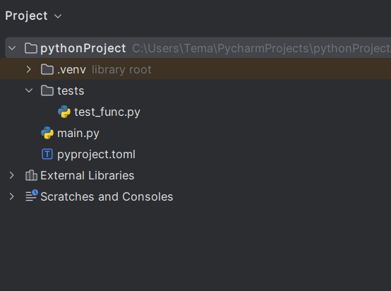
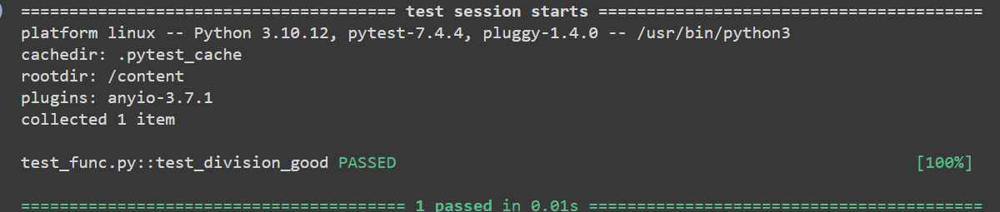
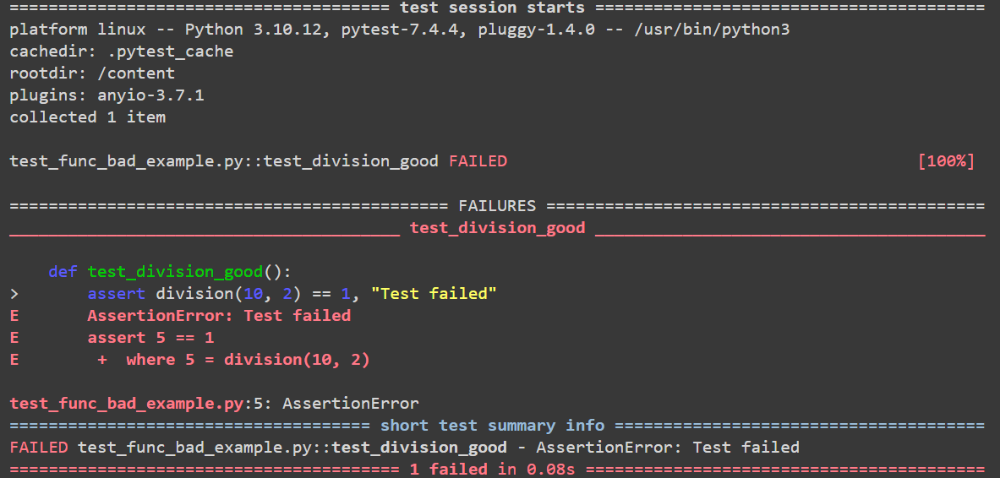
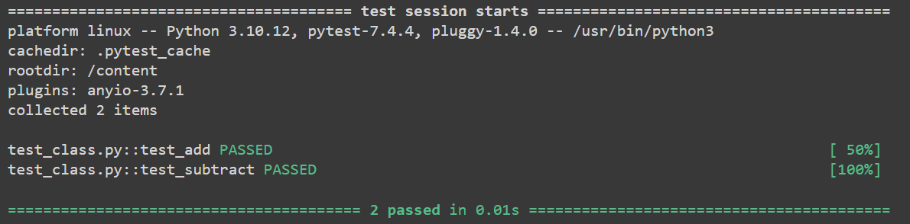
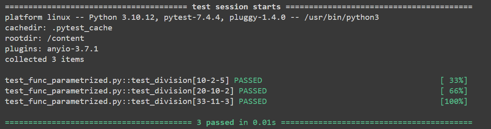
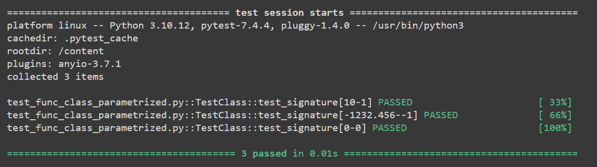
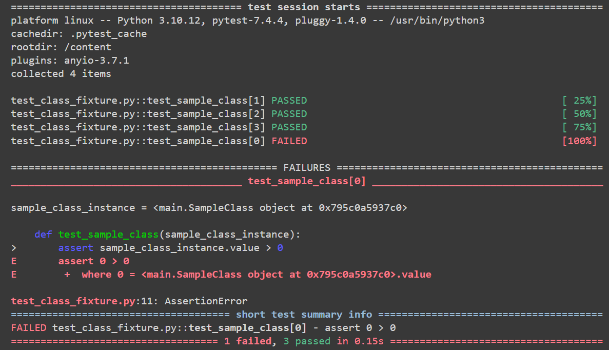
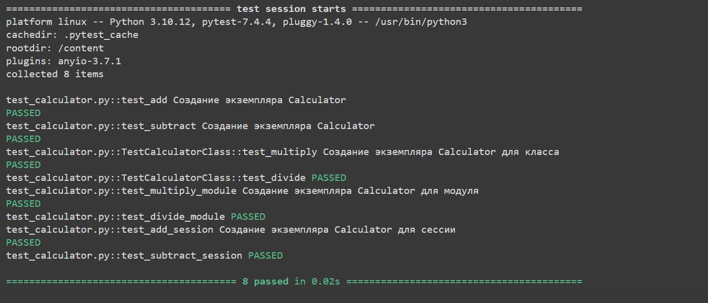
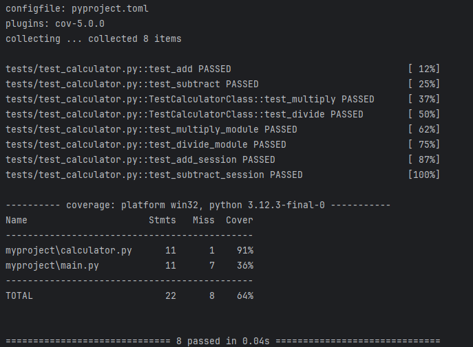

# Python tests tutorial
## Pytest
[pytest](https://docs.pytest.org/en/latest/) - это библиотека для настройки и запуска [автотестов](https://habr.com/ru/companies/otus/articles/720664/)

## Установка

1. Чтобы установить библиотеку pytest, можно использовать pip(но можно и [другие](https://dev.to/adamghill/python-package-manager-comparison-1g98)), менеджер пакетов Python.
2. Чтобы установить pytest, выполните следующую команду: `pip install pytest`
3. После установки, вы можете проверить, что pytest установлен, выполнив следующую команду: `python -m pytest --version` (должна появиться версия pytest-а)

## Начало работы

### Иерархия файлов

Для начала работы с pytest необходимо создать в директории проекта папку tests Каждый файл с тестами в этой папке должен иметь определенный нейминг:
* название файла должно начинаться на `test_`
* название функции должно быть написано в нижнем регистре и начинаться с `test_`


> `pyproject.toml` файл это про пакетный менеджер `poetry`. Подробнее про poetry [тут](https://python-poetry.org/docs/#installation), а про сам файл `pyproject.toml` [тут](https://packaging.python.org/en/latest/specifications/pyproject-toml/) и [тут](https://stackoverflow.com/questions/62983756/what-is-pyproject-toml-file-for)


### Напишем для примера функцию деления протестируем ее
`myproject/main.py`:
```python
def division(number_1: int, number_2: int) -> int:
    """Returns division of two numbers
    :param number_1: First number
    :param number_2: Second number
    :return: Division of two numbers"""
    
    return int(number_1 / number_2)
```

Теперь в модуле тестирования test_func.py импортируем эту функцию и пропишем первые тесты:

```python
from myproject.main import division


def test_division_good():
    assert division(10, 2) == 5
```

Инструкция assert является булевым выражением, которое проверяет, является ли условие истинным или ложным. Если оно истинно, то программа ничего не делает и переходит к выполнению следующей строчки кода, если оно ложно, то программа останавливается и возвращает ошибку. Через запятую после условия можно написать отладочное сообщение. Pytest выведет его, если тест провалится

### Запуск тестов

Чтобы запустить тесты, введём в консоль команду pytest. Также можно использовать интерфейс вашей IDE. Например, PyCharm позволяет запустить файл целиком или тестовую функцию в отдельности.

```shell
python -m pytest -vv tests/test_func.py
```



### Рассмотрим случай, когда ожидаемый результат не совпал с настоящим
Изменим код нашей функции и запустим тестирование:
```python
from myproject.main import division
...
def test_division_good():
    assert division(10, 2) == 1, "Test failed"
```

```shell
python -m pytest -vv tests/test_func_bad_example.py
```



Как и ожидалось, получили ошибку AssertionError

## Классы тестирования

Мы часто хотим сгруппировать связанные тесты, чтобы они могли совместно использовать общие методы. Мы можем сделать это, записав тесты как методы класса.

В классах точно так же, как и в функциях с определенными именами, pytest ищет тесты в файлах, pytest будет искать тесты только в классах, начинающихся с Test, а методы класса - с test_.


### Напишем еще один пример функции и тестов для нее
Реализуем в файле main математическую функцию `SIGN`, возвращающую 1, -1, 0 при положительных, отрицательных числах и нуле соответственно.

```python
def signature(number: float) -> int:
    """
    Return 1 if positive, -1 if negative, 0 if zero
    :param number:
    :return: Signature of the number: int
    """
    if number == 0:
        return 0
    elif number > 0:
        return 1
    else:
        return -1

```
В файле `tests/test_func_class.py` с помощью методов класса `TestClass` реализуем тестирование нашей функции:

```python
from myproject.main import signature
...
class TestClass:
    def test_signature(self):
        assert signature(10) == 1

    def test_signature2(self):
        assert signature(-1232.456) == -1

    def test_signature3(self):
        assert signature(0) == 0
```

Запустим тесты:
```shell
python -m pytest -vv tests/test_func_class.py
```

### Тестировать можно не только функции, но и методы класса
Реализуем класс `Calculator` с методами сложения и вычитания в файле `myproject/calculator.py`

```python
class Calculator:
    """
    Calculator class
    """
    def add(self, a: float, b: float) -> float:
        """
        Adding two numbers
        :param a:
        :param b:
        :return: Sum of two numbers: float
        """
        return a + b

    def subtract(self, a: float, b: float) -> float:
        """
        Subtracting two numbers
        :param a:
        :param b:
        :return: Difference of two numbers: float
        """
        return a - b
```

Протестируем ее с помощью функций:

```python
from myproject.calculator import Calculator


def test_add():
    calc = Calculator()
    assert calc.add(2, 3) == 5


def test_subtract():
    calc = Calculator()
    assert calc.subtract(3, 2) == 1
```

```shell
python -m pytest -vv tests/test_class.py
```




## Параметризация тестов

Метка parametrize позволяет вызывать один и тот же тест с разными входными данными. Это полезно, когда мы хотим проверить несколько случаев. Параметризуем нашу функцию тестирования. Для этого импортируем библиотеку pytest и пропишем метку parametrize с несколькими тестами.

Можно в одной строке через запятую передать сразу несколько переменных. Тогда каждый элемент списка задаётся кортежем, в котором мы по очереди перечисляем значения этих переменных:

```python
from myproject.main import division
import pytest


@pytest.mark.parametrize("num_1, num_2, expected", [(10, 2, 5),
                                                    (20, 10, 2),
                                                    (33, 11, 3)])
def test_division(num_1, num_2, expected):
    assert division(num_1, num_2) == expected
```
Проверим результат:
```shell
python -m pytest -vv tests/test_func_parametrized.py
```



Параметризовать можно и класс, сделаем это для нашего класса TestClass:
```python
from myproject.main import signature
import pytest


@pytest.mark.parametrize("number, expection", [(10, 1), (-1232.456, -1), (0, 0)])
class TestClass:
    def test_signature(self, number, expection):
        assert signature(number) == expection

```
```shell
python -m pytest -vv tests/test_func_class_parametrized.py
```



## Фикстуры

Фикстуры в pytest — это способ предоставления тестам данных, настройки и состояния, которые могут использоваться во множестве тестов. Они позволяют избежать дублирования кода и упростить настройку тестового окружения.

Как работают фикстуры: Фикстуры определяются с помощью декоратора `@pytest.fixture`, который помечает функцию как фикстуру. Эта функция будет выполнена перед каждым тестом, который вызывает эту фикстуру.

Фикстуры принято объявлять в файле `conftest.py` рядом с тестовыми файлами.

Напишем фикстуру `sample_data`, которая возвращает список чисел. Этот список будет доступен для каждого теста, который вызывает фикстуру `sample_data`.

`tests/conftest.py`:
```python
import pytest


@pytest.fixture
def sample_data():
    return [1, 2, 3, 4, 5]
```

`tests/test_func_fixture.py`:
```python
def test_sum(sample_data):
    assert sum(sample_data) == 15
```

```shell
python -m pytest -vv tests/test_func_fixture.py
```


### Параметры фикстур

Фикстуры могут принимать параметры, которые позволяют настраивать их поведение. Например, вы можете использовать фикстуру для создания разных экземпляров класса с разными параметрами. Ниже приведен пример, в котором фикстура создает три объекта класса SampleClass, которые потом передаются тестирующей функции

`myproject/main.py`:
```python
class SampleClass:
    def __init__(self, value):
        self.value = value
```
`tests/conftest.py`:
```python
import pytest

from myproject.main import SampleClass
...
@pytest.fixture(params=[1, 2, 3, 0])
def sample_class_instance(request):
    return SampleClass(request.param)
```
`tests/test_class_fixture.py`:
```python
def test_sample_class(sample_class_instance):
    assert sample_class_instance.value > 0
```
`sample_class_instance` — это фикстура с параметром(в декораторе) `params`, которая создает три разных экземпляра `SampleClass` с разными значениями. Каждый экземпляр будет использоваться для каждого вызова теста, который вызывает фикстуру `sample_class_instance` (Чтобы не забывать, как выглядят проваленные тесты, сделаем один тест неверным🙂):

```shell
python -m pytest -vv tests/test_class_fixture.py
```



### Область видимости фикстур

Фикстуры могут иметь различные уровни видимости: `function`, `class`, `module`, `session`. Это определяет, когда будет выполняться фикстура: один раз для каждой функции, класса, модуля или всего сеанса тестирования соответственно.

Модифицируем наш класс `Calculator`, добавив новые методы:
```python
class Calculator:
    """
    Calculator class
    """
    def add(self, a: float, b: float) -> float:
        """
        Adding two numbers
        :param a:
        :param b:
        :return: Sum of two numbers: float
        """
        return a + b

    def subtract(self, a: float, b: float) -> float:
        """
        Subtracting two numbers
        :param a:
        :param b:
        :return: Difference of two numbers: float
        """
        return a - b

    def multiply(self, a: float, b: float) -> float:
        """
        Multiplying two numbers
        :param a:
        :param b:
        :return: Product of two numbers: float
        """
        return a * b

    def divide(self, a: float, b: float) -> float:
        """
        Dividing two numbers
        :param a:
        :param b:
        :return: Division of two numbers: float
        """
        if b != 0:
            return a / b
        else:
            raise ValueError("Cannot divide by zero")
```

Теперь напишем тесты для этого класса, используя различные уровни видимости фикстур:

`tests/conftest.py`:
```python
import pytest

from myproject.main import Calculator
...
@pytest.fixture(scope='function')
def calculator_function():
    print("Создание экземпляра Calculator")
    return Calculator()


@pytest.fixture(scope='class')
def calculator_class():
    print("Создание экземпляра Calculator для класса")
    return Calculator()


@pytest.fixture(scope='module')
def calculator_module():
    print("Создание экземпляра Calculator для модуля")
    return Calculator()


@pytest.fixture(scope='session')
def calculator_session():
    print("Создание экземпляра Calculator для сессии")
    return Calculator()
```

В этом примере мы используем различные уровни видимости фикстур:

`function`: Фикстура `calculator_function` будет создавать новый экземпляр `Calculator` для каждой функции теста.

`class`: Фикстура `calculator_class` будет создавать новый экземпляр `Calculator` для каждого класса теста.

`module`: Фикстура `calculator_module` будет создавать новый экземпляр `Calculator` для каждого модуля теста.

`session`: Фикстура `calculator_session` будет создавать новый экземпляр `Calculator` один раз для всей сессии тестирования.

Каждый тест использует соответствующую фикстуру для получения экземпляра `Calculator` и выполнения тестов.

```shell
python -m pytest -vv -s tests/test_calculator.py
```


Обратите внимание, что фикстура `calculator_session` вызывается только один раз, независимо от количества тестов, которые её используют. Это может быть полезно для настройки и очистки ресурсов, которые должны быть доступны для всех тестов в сеансе.

## Плагины для pytest

### pytest-cov

[pytest-cov](https://pytest-cov.readthedocs.io/en/latest/) — это плагин для `pytest`, который позволяет вам получить отчет о покрытии кода тестами. Он показывает, какая часть вашего кода была затронута тестами, а какая нет.

#### Установка
Для `pip`:
```shell
pip install pytest-cov
```
Для `poetry`:
```shell
poetry add --group dev pytest-cov
```

#### Использование
```shell
python -m pytest --cov=myproject -vv tests/test_calculator.py
```


В нашем случае в проекте myproject лежит файл main.py со всеми написанными нами функциями и классами для тестов, а для тестирования в папке `tests` лежит файл `test_calculator.py`, тестирующий только функции класса `Calculator`. Так как остальные функции и классы не используются, покрытие составляет 64%.

### pytest-mock

[pytest-mock](https://pytest-mock.readthedocs.io/en/latest/) — это плагин для pytest, который позволяет вам использовать мокинг (техника, которая позволяет разработчикам и тестировщикам имитировать поведение объектов) в тестах. Это особенно полезно, когда вы хотите протестировать код, который взаимодействует с внешними зависимостями, такими как базы данных, файловые системы или сетевые сервисы.

#### Установка
Для `pip`:
```shell
pip install pytest-mock
```
Для `poetry`:
```shell
poetry add --group dev pytest-mock
```

#### Использование
```python
import myproject


def test_example(mocker):
    mocked_func = mocker.patch('myproject.main.signature')
    mocked_func.return_value = 'mocked'

    assert myproject.main.signature(1) == 'mocked'
```
**ВАЖНО**: при создании мока на какой-то объект в другом модуле, он ОБЯЗАТЕЛЬНО должен быть объектом,
к которому мы получаем доступ через этот самый модуль(ещё можно через класс, но это моветон; почему - подумайте сами):

!!! ЭТО **НЕ**РАБОЧИЙ КОД !!!
```python
from myproject.main import signature


def test_example(mocker):
    mocked_func = mocker.patch('myproject.main.signature')
    mocked_func.return_value = 'mocked'

    assert signature(1) == 'mocked'
```
^^^ ТАК **НЕ** СРАБОТАЕТ ^^^

Нужно как в примере использования выше!


В этом примере `mocker.patch` используется для подмены функции `signature` в модуле `main` пакета `myproject`. Затем мы проверяем, что функция возвращает значение, которое мы установили в моке.

```shell
python -m pytest -s tests/test_example.py
```

> `-s` тут это `--capture=no`, что означает, что вывод стандартного потока вывода не будет осуществлен в рамках тестов

## pytest-xdist

[pytest-xdist](https://pytest-xdist.readthedocs.io/en/latest/) — это плагин для pytest, который позволяет вам выполнять тесты параллельно. Полезно, когда тестов много и/или они довольно долгие.

#### Установка
Для `pip`:
```shell
pip install pytest-xdist
```
Для `poetry`:
```shell
poetry add --group dev pytest-xdist
```

#### Использование

Запустит тесты в 10 процессов:
```shell
python -m pytest -n 10 tests/
```
Запустит тесты в количестве процессов, сколько у вас ядер:
```shell
python -m pytest -n auto tests/
```